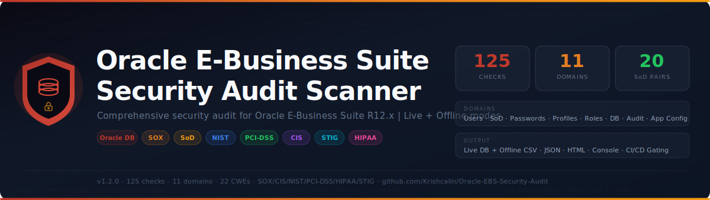

# Oracle E-Business Suite Security Audit Scanner

<p align="center">
  
</p>

<p align="center">
  <strong>Open-source Python security audit tool for Oracle E-Business Suite R12.x</strong><br>
  125 checks across 11 security domains &bull; Live DB + Offline CSV modes &bull; JSON + HTML + Console reports
</p>

<p align="center">
  <a href="#quick-start">Quick Start</a> &bull;
  <a href="#check-categories">Check Categories</a> &bull;
  <a href="#output-formats">Output</a> &bull;
  <a href="#required-privileges">Privileges</a> &bull;
  <a href="#compliance-mapping">Compliance</a>
</p>

---

## Overview

Two single-file Python scanners that perform **125 security audit checks** across user access, segregation of duties, profile options, database hardening, application configuration, patching, workflow controls, and more. Choose **Live** mode (direct database connection) or **Offline** mode (analyze CSV exports). Designed for security auditors, IT risk teams, and EBS administrators.

| Scanner | Mode | Lines | Dependency |
|---------|------|------:|------------|
| `oracle_ebs_scanner.py` | Live DB (oracledb) | ~3,430 | `oracledb` |
| `oracle_ebs_offline_scanner.py` | Offline CSV | ~3,020 | None (stdlib) |
| `export_ebs_audit_data.sql` | 34 SQL export queries | ~571 | — |

- **125 checks** across 11 categories
- **20 SoD conflict pairs** covering all major financial modules
- **Python 3.8+**, MIT License

---

## Quick Start

```bash
# Install dependency
pip install oracledb

# Run with Easy Connect syntax
python oracle_ebs_scanner.py \
    --host dbhost.example.com \
    --port 1521 \
    --service EBSPROD \
    --user APPS

# Run with DSN string + all output formats
python oracle_ebs_scanner.py \
    --dsn "dbhost:1521/EBSPROD" \
    --user APPS \
    --json report.json \
    --html report.html \
    --severity MEDIUM

# Using environment variables
export ORA_HOST=dbhost ORA_SERVICE=EBSPROD ORA_USER=APPS ORA_PASSWORD=secret
python oracle_ebs_scanner.py --json report.json
```

The password is prompted securely if not provided via `--password` or `ORA_PASSWORD`.

---

## CLI Reference

```
usage: oracle_ebs_scanner [-h] [--host HOST] [--port PORT] [--service SERVICE]
                          [--dsn DSN] [--user USER] [--password PASS]
                          [--severity {CRITICAL,HIGH,MEDIUM,LOW,INFO}]
                          [--json FILE] [--html FILE] [--verbose] [--version]

Options:
  --host HOST          Database hostname (env: ORA_HOST)
  --port PORT          Database port, default 1521 (env: ORA_PORT)
  --service SERVICE    Database service name (env: ORA_SERVICE)
  --dsn DSN            Full DSN "host:port/service" (env: ORA_DSN)
  --user, -u USER      Database username, typically APPS (env: ORA_USER)
  --password, -p PASS  Database password, prompted if omitted (env: ORA_PASSWORD)
  --severity SEV       Minimum severity to report (default: INFO)
  --json FILE          Save JSON report
  --html FILE          Save HTML report (self-contained, filterable)
  --verbose, -v        Show passed checks, SQL details
  --version            Show version and exit
```

**Exit codes:** `1` if any CRITICAL or HIGH findings, `0` otherwise — ready for CI/CD pipeline gating.

---

## Offline Scanner

When direct database access is not available, use the **offline scanner** to analyze CSV exports:

```bash
# Step 1: DBA runs export queries and saves each result as CSV
#         (use SQL*Plus, SQLcl, SQL Developer, Toad, or DBeaver)
sqlplus APPS/password@EBSPROD @export_ebs_audit_data.sql

# Step 2: Place all CSV files in a directory
ls ebs_export/
# instance_info.csv  ebs_users.csv  ebs_user_responsibilities.csv  ...

# Step 3: Run the offline scanner (zero dependencies)
python oracle_ebs_offline_scanner.py ./ebs_export/
python oracle_ebs_offline_scanner.py ./ebs_export/ \
    --json report.json --html report.html --severity HIGH

# Optional: specify the export date for accurate age calculations
python oracle_ebs_offline_scanner.py ./ebs_export/ --ref-date 2025-01-15
```

### Required CSV files (4)
`instance_info.csv`, `ebs_users.csv`, `ebs_user_responsibilities.csv`, `ebs_profile_options.csv`

### Optional CSV files (30)
`ebs_responsibilities.csv`, `ebs_concurrent_programs.csv`, `ebs_request_group_access.csv`, `ebs_concurrent_requests.csv`, `ebs_audit_config.csv`, `ebs_patches.csv`, `ebs_workflow_components.csv`, `ebs_workflow_stuck.csv`, `ebs_workflow_errors.csv`, `ebs_login_audit_old.csv`, `ebs_logins.csv`, `ebs_approval_limits.csv`, `ebs_hold_codes.csv`, `ebs_lookup_types.csv`, `ebs_flex_rules.csv`, `ebs_alerts.csv`, `ebs_form_functions.csv`, `ebs_dff_config.csv`, `ebs_xml_gateway.csv`, `ebs_irep_services.csv`, `db_users.csv`, `db_role_privs.csv`, `db_tab_privs.csv`, `db_links.csv`, `db_profiles.csv`, `db_parameters.csv`, `db_sys_privs.csv`, `db_dv_status.csv`, `db_fga_policies.csv`, `db_unified_audit.csv`

> Checks are skipped gracefully when optional CSV files are absent.

---

## Check Categories

### 1. User Account Security (`ORA-USER-001` .. `015`) — 15 checks

| Check | Severity | Description |
|-------|----------|-------------|
| ORA-USER-001 | HIGH | Default/seeded accounts (SYSADMIN, GUEST, etc.) still active |
| ORA-USER-002 | MEDIUM | Inactive users (no login > 90 days) not disabled |
| ORA-USER-003 | LOW | Users without end date set |
| ORA-USER-004 | MEDIUM | Orphan accounts with no employee/person link |
| ORA-USER-005 | CRITICAL | Terminated employees with active EBS accounts |
| ORA-USER-006 | HIGH | Shared or generic accounts detected |
| ORA-USER-007 | LOW | Users created > 30 days ago who never logged in |
| ORA-USER-008 | INFO | Active user population summary |
| ORA-USER-009 | HIGH | Self-service registration enabled without approval |
| ORA-USER-010 | MEDIUM | Single Sign-On / MFA not configured |
| ORA-USER-011 | MEDIUM | Recent accounts created without HR link |
| ORA-USER-012 | HIGH | Weak password hash algorithm detected |
| ORA-USER-013 | HIGH | Direct APPS schema login detected |
| ORA-USER-014 | HIGH | SysAdmin users holding financial responsibilities |
| ORA-USER-015 | MEDIUM | Concurrent login limit not enforced |

### 2. Password & Authentication (`ORA-PWD-001` .. `006`) — 6 checks

| Check | Severity | Description |
|-------|----------|-------------|
| ORA-PWD-001 | HIGH | Password never changed since account creation |
| ORA-PWD-002 | MEDIUM | Passwords older than 90 days |
| ORA-PWD-003 | CRITICAL | Failed login limit not configured or too high |
| ORA-PWD-004 | HIGH | Minimum password length not set or < 8 |
| ORA-PWD-005 | HIGH | Password complexity (hard-to-guess) not enforced |
| ORA-PWD-006 | MEDIUM | Password reuse not prevented |

### 3. Profile Options (`ORA-PROF-001` .. `010`) — 10 checks

| Check | Severity | Description |
|-------|----------|-------------|
| ORA-PROF-001 | MEDIUM | Session timeout (ICX_SESSION_TIMEOUT) not set or > 60 min |
| ORA-PROF-002 | HIGH | Guest user password contains default value |
| ORA-PROF-003 | MEDIUM | FND_DIAGNOSTICS enabled in production |
| ORA-PROF-004 | LOW | Application framework logging enabled |
| ORA-PROF-005 | HIGH | APPS_SERVLET_AGENT not using HTTPS |
| ORA-PROF-006 | HIGH | APPS_FRAMEWORK_AGENT not using HTTPS |
| ORA-PROF-007 | LOW | Sign-on notification disabled |
| ORA-PROF-008 | MEDIUM | Concurrent session limit not set |
| ORA-PROF-009 | LOW | OA Framework customization enabled |
| ORA-PROF-010 | MEDIUM | Sign-on audit level not configured or too low |

### 4. Responsibility & Access (`ORA-ROLE-001` .. `006`) — 6 checks

| Check | Severity | Description |
|-------|----------|-------------|
| ORA-ROLE-001 | CRITICAL | Excessive System Administrator users (> 3) |
| ORA-ROLE-002 | HIGH | Users with 3+ sensitive responsibilities |
| ORA-ROLE-003 | varies | Sensitive responsibility assigned to too many users |
| ORA-ROLE-004 | LOW | Responsibility assignments without end date |
| ORA-ROLE-005 | MEDIUM | Inactive (end-dated) responsibilities still assigned to users |
| ORA-ROLE-006 | HIGH | Custom responsibilities with system admin menus |

### 5. Segregation of Duties (`ORA-SOD-001` .. `020`) — 20 checks

| Check | Severity | Conflict |
|-------|----------|----------|
| ORA-SOD-001 | HIGH | Accounts Payable + Accounts Receivable |
| ORA-SOD-002 | HIGH | Accounts Payable + Purchasing |
| ORA-SOD-003 | HIGH | General Ledger + Accounts Payable |
| ORA-SOD-004 | HIGH | Purchasing + Inventory |
| ORA-SOD-005 | HIGH | System Administrator + Accounts Payable |
| ORA-SOD-006 | HIGH | Human Resources + Accounts Payable |
| ORA-SOD-007 | HIGH | Accounts Receivable + Cash Management |
| ORA-SOD-008 | HIGH | General Ledger + Journal Entry |
| ORA-SOD-009 | HIGH | Purchasing + Receiving |
| ORA-SOD-010 | HIGH | Inventory + Inventory Adjustment |
| ORA-SOD-011 | HIGH | Fixed Assets (Add + Retire) |
| ORA-SOD-012 | HIGH | Cash Management (Statement + Reconcile) |
| ORA-SOD-013 | HIGH | Human Resources + Payroll |
| ORA-SOD-014 | HIGH | Accounts Payable + Supplier/Vendor |
| ORA-SOD-015 | HIGH | Purchasing + Buyer |
| ORA-SOD-016 | HIGH | General Ledger + Period Open/Close |
| ORA-SOD-017 | HIGH | Accounts Payable + Hold/Release |
| ORA-SOD-018 | HIGH | Order Management + Accounts Receivable |
| ORA-SOD-019 | HIGH | Purchasing + General Ledger |
| ORA-SOD-020 | HIGH | System Administrator + General Ledger |

### 6. Concurrent Programs (`ORA-CONC-001` .. `010`) — 10 checks

| Check | Severity | Description |
|-------|----------|-------------|
| ORA-CONC-001 | HIGH | Dangerous programs (FNDCPASS, FNDLOAD, etc.) in non-admin groups |
| ORA-CONC-002 | MEDIUM | Host-based concurrent programs enabled (OS execution) |
| ORA-CONC-003 | MEDIUM | Application-level request group grants (unrestricted) |
| ORA-CONC-004 | MEDIUM | Programs submitted under privileged accounts |
| ORA-CONC-005 | MEDIUM | Shell/host execution concurrent programs |
| ORA-CONC-006 | HIGH | Security-sensitive programs broadly accessible |
| ORA-CONC-007 | INFO | Concurrent output directory configuration |
| ORA-CONC-008 | MEDIUM | FNDCPASS/FNDSCARU recently executed |
| ORA-CONC-009 | LOW | Old concurrent output files not purged |
| ORA-CONC-010 | HIGH | Active responsibilities with ALL-program request groups |

### 7. Audit Trail (`ORA-AUDIT-001` .. `012`) — 12 checks

| Check | Severity | Description |
|-------|----------|-------------|
| ORA-AUDIT-001 | CRITICAL | EBS AuditTrail (AUDITTRAIL:ACTIVATE) not enabled |
| ORA-AUDIT-002 | HIGH | Critical tables not in active audit schema (13 tables checked) |
| ORA-AUDIT-003 | HIGH | Database-level auditing (audit_trail parameter) disabled |
| ORA-AUDIT-004 | MEDIUM | Sign-on audit level insufficient for user tracking |
| ORA-AUDIT-005 | LOW | Audit data older than 1 year needs archival review |
| ORA-AUDIT-006 | HIGH | Profile option changes (FND_PROFILE_OPTION_VALUES) not audited |
| ORA-AUDIT-007 | HIGH | Responsibility assignment changes not audited |
| ORA-AUDIT-008 | HIGH | User account changes (FND_USER) not audited |
| ORA-AUDIT-009 | MEDIUM | No Unified Audit policies enabled (12c+) |
| ORA-AUDIT-010 | LOW | Audit data exceeds 7-year retention period |
| ORA-AUDIT-011 | MEDIUM | Financial records missing WHO column data |
| ORA-AUDIT-012 | LOW | Concurrent request history needs purging |

### 8. Database Security (`ORA-DB-001` .. `018`) — 18 checks

| Check | Severity | Description |
|-------|----------|-------------|
| ORA-DB-001 | HIGH | Default database accounts (SYS, SCOTT, etc.) not locked |
| ORA-DB-002 | HIGH | PUBLIC role has EXECUTE on sensitive packages (UTL_FILE, etc.) |
| ORA-DB-003 | CRITICAL | Excessive DBA role grants to non-system schemas |
| ORA-DB-004 | CRITICAL/MED | UTL_FILE_DIR parameter set too broadly |
| ORA-DB-005 | CRITICAL | Remote OS authentication enabled |
| ORA-DB-006 | MEDIUM | Database links with potential embedded credentials |
| ORA-DB-007 | MEDIUM | Sensitive package EXECUTE grants to non-DBA schemas |
| ORA-DB-008 | MEDIUM | Excessive open (unlocked) non-EBS database accounts |
| ORA-DB-009 | MEDIUM | Case-sensitive logon disabled |
| ORA-DB-010 | HIGH | PASSWORD_VERIFY_FUNCTION not set in DEFAULT profile |
| ORA-DB-011 | HIGH | Network encryption (SQLNET.ENCRYPTION_SERVER) not enforced |
| ORA-DB-012 | HIGH | O7_DICTIONARY_ACCESSIBILITY enabled |
| ORA-DB-013 | HIGH | SELECT ANY TABLE grants to non-DBA schemas |
| ORA-DB-014 | CRITICAL | ALTER SYSTEM privilege grants to non-DBA schemas |
| ORA-DB-015 | HIGH | SYSDBA session auditing disabled |
| ORA-DB-016 | MEDIUM | Database login rate limiting not configured |
| ORA-DB-017 | MEDIUM | Oracle Database Vault not enabled |
| ORA-DB-018 | MEDIUM | No Fine-Grained Audit (FGA) policies enabled |

### 9. Patching & Versions (`ORA-PATCH-001` .. `004`) — 4 checks

| Check | Severity | Description |
|-------|----------|-------------|
| ORA-PATCH-001 | CRITICAL/HIGH/INFO | EBS version end-of-life / support status |
| ORA-PATCH-002 | INFO/HIGH | Last applied patch and date |
| ORA-PATCH-003 | CRITICAL/HIGH/INFO | Database version (11g/12c EOL, 19c+ current) |
| ORA-PATCH-004 | HIGH/INFO | Patch activity in last 6 months |

### 10. Workflow & Approvals (`ORA-WF-001` .. `004`) — 4 checks

| Check | Severity | Description |
|-------|----------|-------------|
| ORA-WF-001 | MEDIUM | Stuck workflow items open > 30 days |
| ORA-WF-002 | MEDIUM | Workflow Notification Mailer not running |
| ORA-WF-003 | MEDIUM | Workflow activity errors in last 30 days |
| ORA-WF-004 | LOW | Workflow background engine not running |

### 11. Application Configuration (`ORA-APP-001` .. `015`) — 15 checks

| Check | Severity | Description |
|-------|----------|-------------|
| ORA-APP-001 | HIGH | Document sequencing not enabled (SOX requirement) |
| ORA-APP-002 | HIGH | Users with unlimited financial approval limits |
| ORA-APP-003 | MEDIUM | No active AP invoice hold codes configured |
| ORA-APP-004 | HIGH | Too many users with GL period open/close access |
| ORA-APP-005 | MEDIUM | Critical lookup types not frozen |
| ORA-APP-006 | MEDIUM | No flexfield security rules defined |
| ORA-APP-007 | LOW | OA Framework personalization unrestricted |
| ORA-APP-008 | MEDIUM | Attachments stored on file system |
| ORA-APP-009 | MEDIUM | No security alerts configured |
| ORA-APP-010 | HIGH | Unregistered web functions detected |
| ORA-APP-011 | HIGH | Multi-Org security profile not configured |
| ORA-APP-012 | MEDIUM | Unprotected descriptive flexfields on PII tables |
| ORA-APP-013 | MEDIUM | External self-service modules active (iSupplier, iRecruitment) |
| ORA-APP-014 | MEDIUM | XML Gateway trading partners configured |
| ORA-APP-015 | HIGH | Excessive public Integration Repository services |

---

## Output Formats

### Console (default)
Color-coded terminal output with severity indicators, organized by category.

### JSON (`--json report.json`)
```json
{
  "scanner": "oracle_ebs_scanner",
  "version": "1.2.0",
  "generated": "2025-01-15T14:30:00",
  "instance": "EBSPROD",
  "host": "dbhost.example.com",
  "ebs_version": "12.2.11",
  "db_version": "Oracle Database 19c Enterprise Edition",
  "findings_count": 42,
  "summary": {"CRITICAL": 3, "HIGH": 12, "MEDIUM": 18, "LOW": 5, "INFO": 4},
  "findings": [...]
}
```

### HTML (`--html report.html`)
Self-contained HTML report with:
- Catppuccin Mocha dark theme
- Severity and category filter dropdowns
- Full-text search
- Color-coded severity badges
- Expandable issue/fix details per finding

---

## Required Privileges

The scanner requires **read-only** `SELECT` access. Connect as `APPS` (recommended) or a custom audit schema with grants on:

### EBS Application Tables
```
FND_USER, FND_USER_RESP_GROUPS_DIRECT, FND_RESPONSIBILITY,
FND_RESPONSIBILITY_TL, FND_PROFILE_OPTIONS, FND_PROFILE_OPTION_VALUES,
FND_CONCURRENT_PROGRAMS, FND_CONCURRENT_PROGRAMS_TL,
FND_CONCURRENT_REQUESTS, FND_REQUEST_GROUPS, FND_REQUEST_GROUP_UNITS,
FND_MENUS, FND_LOGINS, FND_LOGIN_RESP_ACTIONS, FND_SVC_COMPONENTS,
FND_PRODUCT_GROUPS, FND_AUDIT_TABLES, FND_AUDIT_SCHEMAS,
FND_LOOKUP_TYPES, FND_LOOKUP_VALUES, FND_FLEX_VALUE_RULE_USAGES,
FND_FORM_FUNCTIONS, FND_MENU_ENTRIES, FND_DESCRIPTIVE_FLEXS,
FND_IREP_CLASSES, WF_ITEMS, WF_ITEM_ACTIVITY_STATUSES, AD_BUGS,
PER_ALL_PEOPLE_F, AP_APPROVAL_LIMITS, AP_HOLD_CODES, AP_INVOICES_ALL,
ALR_ALERTS, ECX_TP_HEADERS
```

### Database Dictionary Views
```
V$PARAMETER, V$VERSION, V$INSTANCE,
DBA_USERS, DBA_ROLE_PRIVS, DBA_TAB_PRIVS, DBA_DB_LINKS, DBA_PROFILES,
DBA_SYS_PRIVS, DBA_DV_STATUS, DBA_AUDIT_POLICIES,
AUDIT_UNIFIED_ENABLED_POLICIES
```

> **Note:** If the connecting user lacks access to specific views (e.g., `DBA_*`), those checks will be skipped gracefully with a verbose-mode message.

---

## Compliance Mapping

| Framework | Covered Domains |
|-----------|----------------|
| **SOX (Sarbanes-Oxley)** | SoD controls (20 pairs), document sequencing, approval limits, audit trail, period controls |
| **CIS Oracle Database Benchmark** | DB hardening, password policies, PUBLIC privileges, audit config, network encryption |
| **NIST 800-53** | AC (Access Control), AU (Audit), IA (Identification & Auth), CM (Config Mgmt), SC (System/Comms) |
| **PCI-DSS v4.0** | Req 2 (no defaults), Req 7 (access control), Req 8 (authentication), Req 10 (audit logging) |
| **HIPAA** | Access controls, audit controls, person authentication |
| **ISO 27001** | A.9 Access Control, A.12 Operations Security, A.18 Compliance |
| **DISA STIG** | DB parameters, audit configuration, authentication controls, encryption |

---

## CWE Coverage

The scanner maps findings to the following CWE identifiers:

| CWE | Description | Example Checks |
|-----|-------------|----------------|
| CWE-78 | OS Command Injection | ORA-CONC-002, ORA-CONC-005 |
| CWE-215 | Information Exposure via Debug | ORA-PROF-003 |
| CWE-250 | Unnecessary Privileges | ORA-CONC-004, ORA-USER-013 |
| CWE-262 | Not Using Password Aging | ORA-PWD-002 |
| CWE-269 | Improper Privilege Management | ORA-ROLE-*, ORA-DB-002/003/012/013/014, ORA-APP-002/004/006/011/015 |
| CWE-284 | Improper Access Control | ORA-USER-*, ORA-SOD-*, ORA-APP-001/005/010/012, ORA-WF-001 |
| CWE-285 | Improper Authorization | ORA-USER-002/005 |
| CWE-287 | Improper Authentication | ORA-USER-006, ORA-DB-005 |
| CWE-307 | Excessive Auth Attempts | ORA-PWD-003, ORA-DB-016 |
| CWE-308 | Single-Factor Authentication | ORA-USER-010 |
| CWE-319 | Cleartext Transmission | ORA-PROF-005/006, ORA-DB-011 |
| CWE-400 | Resource Consumption | ORA-PROF-008, ORA-USER-015 |
| CWE-521 | Weak Password Requirements | ORA-PWD-001/004/005/006, ORA-DB-009/010 |
| CWE-522 | Insufficiently Protected Credentials | ORA-DB-006 |
| CWE-532 | Sensitive Info in Log File | ORA-PROF-004, ORA-CONC-009 |
| CWE-611 | XML External Entity | ORA-APP-014 |
| CWE-613 | Insufficient Session Expiration | ORA-PROF-001 |
| CWE-732 | Incorrect Permission Assignment | ORA-DB-004, ORA-APP-008 |
| CWE-778 | Insufficient Logging | ORA-AUDIT-*, ORA-APP-009 |
| CWE-798 | Hard-coded Credentials | ORA-USER-001, ORA-PROF-002, ORA-DB-001 |
| CWE-916 | Weak Password Hash | ORA-USER-012 |
| CWE-1104 | Unmaintained Components | ORA-PATCH-004 |

---

## Rule ID Convention

```
ORA-{CATEGORY}-{NNN}

Categories:
  USER   — User Account Security           (001-015)
  PWD    — Password & Authentication        (001-006)
  PROF   — Profile Options                  (001-010)
  ROLE   — Responsibility & Access          (001-006)
  SOD    — Segregation of Duties            (001-020)
  CONC   — Concurrent Programs              (001-010)
  AUDIT  — Audit Trail                      (001-012)
  DB     — Database Security                (001-018)
  PATCH  — Patching & Versions              (001-004)
  WF     — Workflow & Approvals             (001-004)
  APP    — Application Configuration        (001-015)
```

---

## Environment Variables

| Variable | Description | CLI Equivalent |
|----------|-------------|---------------|
| `ORA_HOST` | Database hostname | `--host` |
| `ORA_PORT` | Database port (default: 1521) | `--port` |
| `ORA_SERVICE` | Database service name | `--service` |
| `ORA_DSN` | Full DSN string | `--dsn` |
| `ORA_USER` | Database username | `--user` |
| `ORA_PASSWORD` | Database password | `--password` |

---

## Version History

| Version | Checks | Domains | Highlights |
|---------|-------:|--------:|------------|
| v1.0.0 | 68 | 10 | Initial release — live + offline scanners |
| v1.2.0 | 125 | 11 | +42 deepened checks, +15 Application Configuration domain, 20 SoD pairs |

---

## Related Projects

| Project | Description |
|---------|-------------|
| [Static-Application-Security-Testing](https://github.com/Krishcalin/Static-Application-Security-Testing) | Java, PHP, Python, MERN, LLM SAST scanners |
| [AWS-Security-Scanner](https://github.com/Krishcalin/AWS-Security-Scanner) | CloudFormation + Terraform IaC scanner |
| [SAP-SuccessFactors](https://github.com/Krishcalin/SAP-SuccessFactors) | SAP SuccessFactors SSPM scanner |
| [SSPM-ServiceNow](https://github.com/Krishcalin/SSPM-ServiceNow) | ServiceNow SSPM scanner |
| [SAP-Code-Vulnerability-Analyzer](https://github.com/Krishcalin/SAP-Code-Vulnerability-Analyzer) | SAP ABAP/BTP SAST scanner |
| [Kubernetes-KSPM](https://github.com/Krishcalin/Kubernetes-Security-Posture-Management) | Kubernetes security posture management |

---

## License

MIT License - see [LICENSE](LICENSE) for details.
